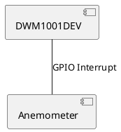
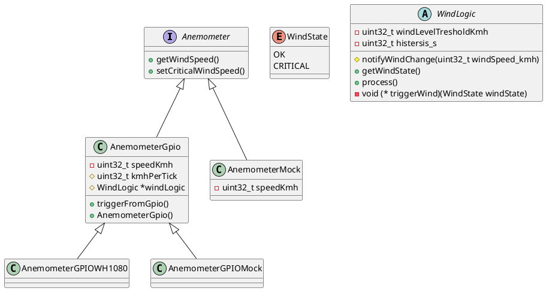

# Meteo

## Peripherals & Power supply

- Anemometer
    - Output is a pin with frequency (2.4km/h = 1Hz)
    - Needs GPIO Interrupt

- Communication
    - UART
        - Logging

- Power supply
    - USB 5V

## Logic

- Does the wind exceeds M (45km/h) for the first time
    - YES - send a command into the UART "Wind: CRITICAL"
    - NO  - send a command into the UART "Wind: OK
- Set the histeresis for L (30 min). Curtains will stay closed even though the wind isn't critical anymore.
- Send the wind info every N (5 min)
- FW update over On-Board debugger

## HW

- DW1001 (https://www.qorvo.com/products/p/DWM1001-DEV)

## Testing

- Manual for now

## Logical HW Scheme

## Class diagrams

## Others

Links:
- https://github.com/embeddedcontainers/examples-zephyr-helloworld

